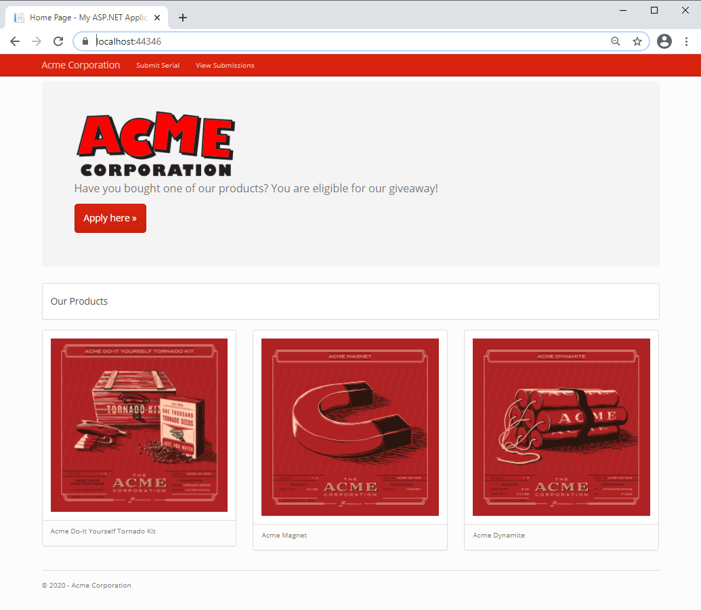
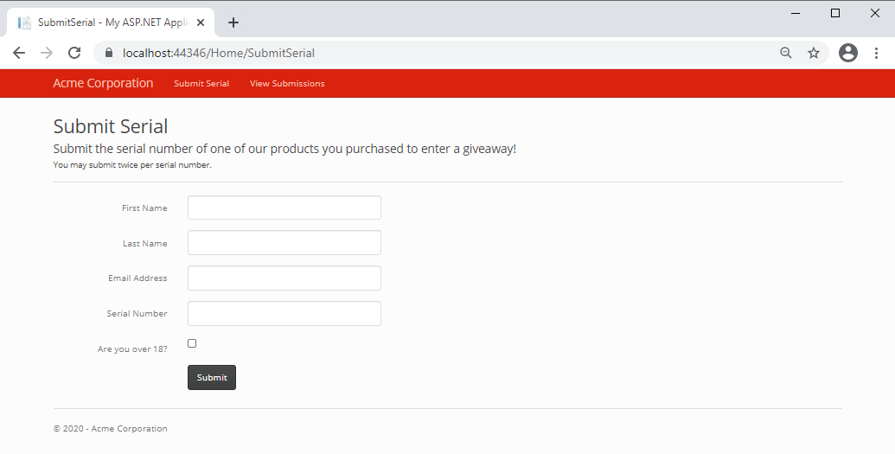
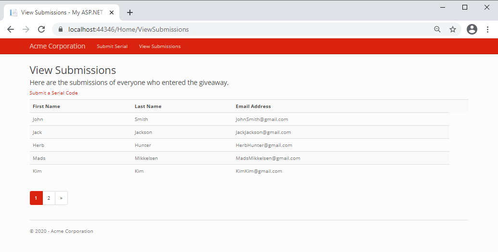
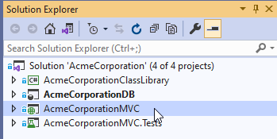
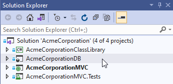
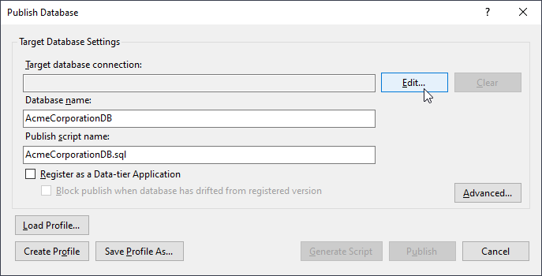
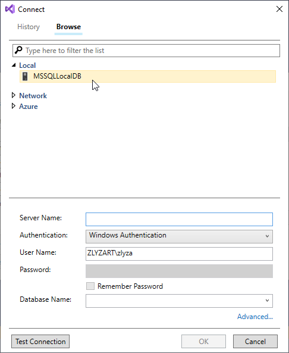
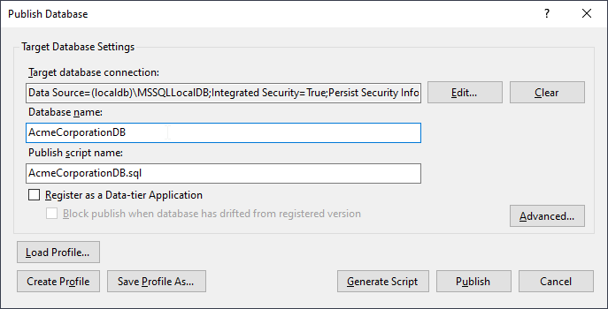
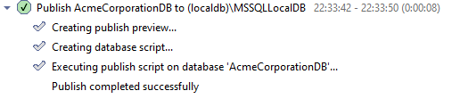
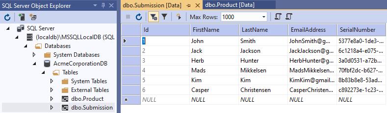

# Acme Corporation
###### Created by *Timmy Christensen*
##### Table of Contents  
  - [Introduction](#introduction)
  - [Preview](#preview)
  - [Project setup](#project-setup)
    - [Step 1 - Startup Project](#step-1---startup-project)
    - [Step 2 - Starting the Database](#step-2---starting-the-database)
    - [Step 3 - Running the project for the first time](#step-3---running-the-project-for-the-first-time)
    - [Step 4 - Product Keys](#step-4---product-keys)
  - [Contact](#contact)

## Introduction
This is an ASP.NET landing page for an international company called “Acme Corporation” that allows people to enter a draw for a prize. A person can enter the draw if they have a valid serial number for purchasing one of Acme Corporation’s products. A person can enter the draw twice for every valid serial number that they have. The person must be at least 18 years old.

## Preview

## Project setup

### Step 1 - Startup Project
In the Solution Explorer, right-click on the project *AcmeCorporationMVC* and click on *Set as Startup Project*.

### Step 2 - Starting the Database
Right-click the project *AcmeCorporationDB* and click on *Publish...*  
  
  
In the *Publish Database* window popup click on *Edit...*  
  
Click on the tab *Browse* and select the local database *MSSQLLocalDB*.   
Then click on the button *OK*  
  
Fill out the field *Database name:* with *AcmeCorporationDB* like shown in the image.  
Then Click on the button *Publish*  
  
If all went well there should be data in the database as well  
  

### Step 3 - Running the project for the first time
Now the project can be run, click yes on trusting the *ISS Express SSL Certificate* and install it.  

### Step 4 - Product Keys
Now the site should be up and running!  
Here are some valid Product Serial Keys that can be used for applying to the giveaway.  
* f5b3c69d-9cdf-414b-bcb6-e77629a32d08
* 180c66a5-5842-4233-9e90-e8d9d8c66024
* 436bc527-8dd6-4626-b6e9-e986c021f68d

## Contact
Feel free to contact me if you have any questions, or if my setup instructions fail.